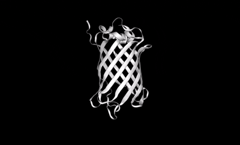

<div align="center">
  
  
  <br/>
  <br/>
  <p><strong>A professional-grade, browser-based 3D workspace for proteins and chemicals.</strong></p>
</div>

<div align="center">
  <a href="https://quercuscode.github.io/QuercusViewer/" target="_blank">
    
  </a>
</div>
<br/>
<div align="center">
  
  
  
  
</div>

<br />

<div align="center">
  
</div>

<br />

**Quercus Viewer** bridges the gap between complex molecular research and accessible, beautiful visualization. Built on top of NGL Viewer, it offers an end-to-end toolkit for analyzing, styling, sharing, and presenting structural data—all without leaving your browser.

---

## ✨ Features

* **Universal Import**: Load directly from **RCSB PDB** and **PubChem**, explore our curated 1000+ molecule library, or drag-and-drop local files (`.pdb`, `.cif`, `.sdf`, `.mol`).
* **Multi-View Analytics**: Compare up to 4 structures side-by-side or in a quad-grid. Perform **Structure Superposition** and analyze 2D **Contact Maps** synced to the 3D viewport.
* **Live Collaboration**: Start a **Live Session** to instantly sync your 3D viewports, camera movements, and representations with remote colleagues or students.
* **Studio & Export**: Record keyframe animations in **Studio Mode**, export publication-ready high-res images, download distance measurements as CSV, or generate PDF summary reports.
* **Advanced Styling**: Layer multiple representations (Cartoon, Licorice, Surface) with custom coloring rules based on B-Factor, Hydrophobicity, or precise residue ranges.
* **Accessible & Fast**: Includes UI themes, OpenDyslexic font support, and history/favorites persistence for a personalized workspace.

---

## 🛠 Tech Stack

Under the hood, Quercus Viewer leverages modern web technologies for maximum performance and maintainability:

* **React 18** for declarative UI.
* **TypeScript** for robust type safety.
* **NGL Viewer** for high-performance WebGL 3D rendering.
* **Tailwind CSS** for rapid, utility-first styling.
* **Vite** for lightning-fast build tooling.

---

## 🚀 Quick Start

Get running locally in seconds:

```bash
git clone https://github.com/QuercusCode/QuercusProteinViewer.git
cd QuercusProteinViewer
npm install
npm run dev
```

Open `http://localhost:5173` to start viewing.

---

## 🤝 Contributing & Support

We welcome contributions! Feel free to open a [GitHub Issue](https://github.com/QuercusCode/QuercusProteinViewer/issues) for bugs, feature requests, or submit a Pull Request.

If you find this tool useful for your research or education, consider supporting its development:

[](https://buymeacoffee.com/amirmcheraghali)

---

## 📫 Contact

Have questions or want to collaborate? Connect with me directly:

* **Email**: [codequercus@gmail.com](mailto:codequercus@gmail.com)
* **LinkedIn**: [Amir M. Cheraghali](https://www.linkedin.com/in/amir-m-cheraghali-195b23207/)

---

## 📄 License

MIT License. Data powered by [RCSB PDB](https://www.rcsb.org/) and [PubChem](https://pubchem.ncbi.nlm.nih.gov/). 3D Engine: [NGL Viewer](http://nglviewer.org/).
